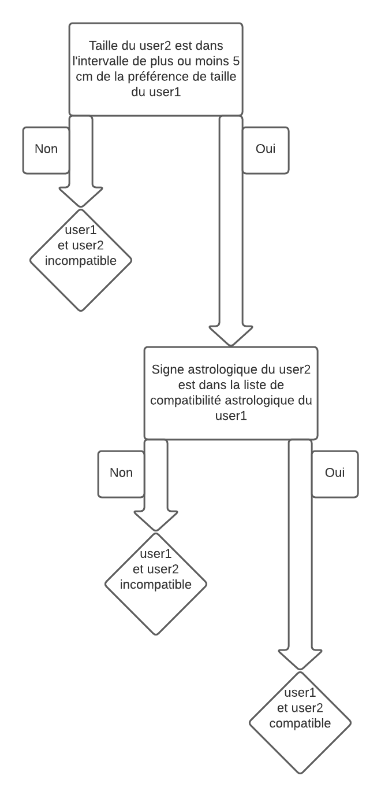

```python
import pandas as pd, numpy as np
import random
```

# Déclaration des signes astrologiques 

J'ai pris pour simplifier seulement 4 signes astrologiques ("bélier","taureau","gémeaux","cancer"). <br> Pour chaque signe astrologique, j'établis une liste de signe astrologique comptatible.<br>
Par exemple le bélier est compatible et avec les taureau et avec les cancer.


```python
signe_astro = ["bélier","taureau","gémeaux","cancer"]

compatibilite = {"bélier":[ "taureau","cancer"],
                "taureau":["gémeaux"],
                "gémeaux": ["taureau"],
                "cancer": ["bélier","taureau","gémeaux"]}
```

# Je crée une base fictive

C'est la le format de la base user que vous me fourniriez. <br>
Elle est visible ci-dessous. J'ai choisi un nombre de 20 utilisateurs pour que la sortie de l'algorithme soit plus facilement interprétable. <br>
Et seulement 3 colonnes : le signe astrologique, la taille et la préférences de taille.


```python
n_user = 20

signe_astro_col = [random.choice(signe_astro) for _ in range(n_user)]
taille_col = np.random.randint(160,190,size=(n_user))
taille_pref_col = np.random.randint(160,190,size=(n_user))

data = {"user_id":range(n_user),
    "signe_astro":signe_astro_col,
       "taille":taille_col,
       "taille_pref":taille_pref_col}

df = pd.DataFrame(data)
df
```


<div>
<table border="1" class="dataframe">
  <thead>
    <tr style="text-align: right;">
      <th></th>
      <th>user_id</th>
      <th>signe_astro</th>
      <th>taille</th>
      <th>taille_pref</th>
    </tr>
  </thead>
  <tbody>
    <tr>
      <th>0</th>
      <td>0</td>
      <td>cancer</td>
      <td>183</td>
      <td>161</td>
    </tr>
    <tr>
      <th>1</th>
      <td>1</td>
      <td>taureau</td>
      <td>168</td>
      <td>163</td>
    </tr>
    <tr>
      <th>2</th>
      <td>2</td>
      <td>bélier</td>
      <td>174</td>
      <td>170</td>
    </tr>
    <tr>
      <th>3</th>
      <td>3</td>
      <td>bélier</td>
      <td>179</td>
      <td>177</td>
    </tr>
    <tr>
      <th>4</th>
      <td>4</td>
      <td>bélier</td>
      <td>178</td>
      <td>170</td>
    </tr>
    <tr>
      <th>5</th>
      <td>5</td>
      <td>bélier</td>
      <td>187</td>
      <td>166</td>
    </tr>
    <tr>
      <th>6</th>
      <td>6</td>
      <td>bélier</td>
      <td>186</td>
      <td>164</td>
    </tr>
    <tr>
      <th>7</th>
      <td>7</td>
      <td>bélier</td>
      <td>184</td>
      <td>176</td>
    </tr>
    <tr>
      <th>8</th>
      <td>8</td>
      <td>gémeaux</td>
      <td>189</td>
      <td>179</td>
    </tr>
    <tr>
      <th>9</th>
      <td>9</td>
      <td>cancer</td>
      <td>162</td>
      <td>160</td>
    </tr>
    <tr>
      <th>10</th>
      <td>10</td>
      <td>gémeaux</td>
      <td>160</td>
      <td>160</td>
    </tr>
    <tr>
      <th>11</th>
      <td>11</td>
      <td>cancer</td>
      <td>168</td>
      <td>166</td>
    </tr>
    <tr>
      <th>12</th>
      <td>12</td>
      <td>taureau</td>
      <td>173</td>
      <td>168</td>
    </tr>
    <tr>
      <th>13</th>
      <td>13</td>
      <td>cancer</td>
      <td>186</td>
      <td>162</td>
    </tr>
    <tr>
      <th>14</th>
      <td>14</td>
      <td>gémeaux</td>
      <td>161</td>
      <td>173</td>
    </tr>
    <tr>
      <th>15</th>
      <td>15</td>
      <td>cancer</td>
      <td>172</td>
      <td>181</td>
    </tr>
    <tr>
      <th>16</th>
      <td>16</td>
      <td>cancer</td>
      <td>174</td>
      <td>177</td>
    </tr>
    <tr>
      <th>17</th>
      <td>17</td>
      <td>taureau</td>
      <td>160</td>
      <td>174</td>
    </tr>
    <tr>
      <th>18</th>
      <td>18</td>
      <td>gémeaux</td>
      <td>160</td>
      <td>185</td>
    </tr>
    <tr>
      <th>19</th>
      <td>19</td>
      <td>bélier</td>
      <td>189</td>
      <td>177</td>
    </tr>
  </tbody>
</table>
</div>


# Arbre de décision

C'est là le format de l'arbe de décision que vous devrez établir. <br> J'ai pris un exemple simple basé sur la taille et sur le signe astrologique. <br>
Je suppose donc que tous les users sont bisexuels pour simplifier les choses.



# Traduction de l'arbre de décision en algorithme


```python
def is_compatible(user1,user2):
    if (user2["taille"] < user1["taille_pref"] +5) & (user2["taille"] > user1["taille_pref"] -5):
        if user2["signe_astro"] in compatibilite[user1["signe_astro"]]:
            return 1
    else:
        return 0
```

# Pour chaque user, je cherche tous les autres user compatibles

Selon les règles de l'arbre de décision plus haut


```python
compatibilite_df = {}
for index, row in df.iterrows():
    compatibilite_df[row["user_id"]] = []
    for _, row_bis in df[df.user_id!=row["user_id"]].iterrows():
        if is_compatible(row,row_bis)==1:
            compatibilite_df[row["user_id"]].append(row_bis["user_id"])  
```

# Sortie de l'algorithme

Ci dessous la sortie de l'algorithme. Pour chaque user on a une liste de user compatible/


```python
compatibilite_df
```


    {0: [10, 14, 17, 18],
     1: [10, 14, 18],
     2: [1, 11, 12, 15, 16],
     3: [12, 16],
     4: [1, 11, 12, 15, 16],
     5: [1, 9, 11],
     6: [1, 9, 11, 17],
     7: [12, 15, 16],
     8: [],
     9: [10, 14, 17, 18],
     10: [17],
     11: [1],
     12: [],
     13: [10, 14, 17, 18],
     14: [12],
     15: [3, 4, 7],
     16: [2, 3, 4, 12],
     17: [],
     18: [],
     19: [12, 16]}


On remarque que le user 8 n'a aucun user compatible. <br>
On remarque aussi  que le user 15 est compatible avec les user 3,4,7. <br>
Ci-dessous, deux tables : 
* le user_id 15
* les user compatible avec lui (user_id : 3,4,7)

# Exemple de sortie pour le user_id 15


```python
df[df.user_id.isin([15])]
```


<div>
<table border="1" class="dataframe">
  <thead>
    <tr style="text-align: right;">
      <th></th>
      <th>user_id</th>
      <th>signe_astro</th>
      <th>taille</th>
      <th>taille_pref</th>
    </tr>
  </thead>
  <tbody>
    <tr>
      <th>15</th>
      <td>15</td>
      <td>cancer</td>
      <td>172</td>
      <td>181</td>
    </tr>
  </tbody>
</table>
</div>


```python
df[df.user_id.isin([3,4,7])]
```


<div>
<table border="1" class="dataframe">
  <thead>
    <tr style="text-align: right;">
      <th></th>
      <th>user_id</th>
      <th>signe_astro</th>
      <th>taille</th>
      <th>taille_pref</th>
    </tr>
  </thead>
  <tbody>
    <tr>
      <th>3</th>
      <td>3</td>
      <td>bélier</td>
      <td>179</td>
      <td>177</td>
    </tr>
    <tr>
      <th>4</th>
      <td>4</td>
      <td>bélier</td>
      <td>178</td>
      <td>170</td>
    </tr>
    <tr>
      <th>7</th>
      <td>7</td>
      <td>bélier</td>
      <td>184</td>
      <td>176</td>
    </tr>
  </tbody>
</table>
</div>


On remarque que les règles de taille et de compatibilité de signe astro ont été respectées.
